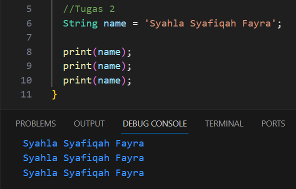

# Soal Quiz 1 - Pemrograman Mobile

> Nama    : Syahla' Syafiqah Fayra
>
> NIM     : 2141720015
>
> Kelas   : TI - 3G

## Soal 1

### Penjelasan
> Pada tugas 1 terdapat kode program print yang berfungsi untuk mengeluarkan output. pada program diatas karena didalam tanda kurung hello world maka hasil yang dikeluarkan yaitu hello world.

---

## Soal 2

### Penjelasan
> Pada tugas 2 terdapat string name yang merupakan hasil dari manipulasi string yang menggunakan tipe data. Setelah itu dikeluarkan ke konsol 3 kali menggunakan perintah print.

## Soal 3

### Penjelasan
> Pada tugas 3 terdapat string firstName yang merupakan deklarasi variabel yang tipe data nya string. final lastName merupakan deklarasi variabel yang tipe datanya final, itu berarti nilainya tidak bisa diubah setelah diinputkan. Dan terakhir ada print(firstName) & (lastName) yang berfungsi untuk mencetak nilai dari variabel firstName dan lastName.

## Soal 4

### Penjelasan
> Pada tugas 4 hasil yang dioutputkan error karena variabel const tidak dapat diubah setelah dideklarasikan sedangkan variabel final tidak dapat diubah setelah diberikan nilai awal, tapi hanya untuk variabel itu sendiri bukan isi dari objek yang dituju. Penjelasan kode 
> * final array1=[1,2,3]; adalah variabel array 1 dideklarasikan sebagai variabel final.
> * const array2=[4,5,6]; adalah variabel array 2 dideklarasikan sebagai variabel const. 
> * array1[0]=100; adalah proses mengubah isi dari array1 menjadi 100
> * array2[0]=100; adalah proses mengubah isi dari array2 menjadi 100
> * print(array1); adalah proses mengeluarkan output dari variabel array 1
> * print(array2); adalah proses mengeluarkan output dari variabel array 2

## Soal 4

### Penjelasan
> Pada tugas 4 terdapat int number1 = 100 yang merupakan variabel number1 dengan tipe data int dan diinisialisasikan dengan 100. double number2 = 100.5 yang merupakan variabel number2 dengan tipe data double dan diinisialisasikan dengan 100.5. tipe data double bisa berupa bilangan desimal sedangkan int hanya bisa bilangan bulat. Setelah itu dilakukan output data menggunakan perintah print.

## Soal 5

### Penjelasan
> pada tugas 5 terdapat num number = 10 yang merupakan deklarasi dari variabel number dengan tipe data num dan diinisialisasikan dengan 10. Setelah itu ada perintah print yang berfungsi untuk mencetak nilai. 
>
> number = 10,5 merupakan pengubahan nilai dari variabel number menjadi 10,5. Setelah itu dilakukan print untuk mencetak kembali nilai dari variabel number.
>
> Tipe data num dapat digunakan untuk tipe data bilangan bulat dan bilangan desimal.

## Soal 6

### Penjelasan
> Pada tugas 6 terdapat kode String firstName dan string lastName yang merupakan deklarasi variabel bertipe data string. Setelah itu ada var fulName = '$firstName ${LastName}'; yang merupakan penggabungan nilai dari firstName dan lastName menjadi 1 string nama lengkap. Terakhir dilakukan cetak nilai dari variabel fulName menggunakan perintah print.

## Soal 7

### Penjelasan
> Pada tugas 7 terdapat kode var text='ini\'OPTIMAL\'\$sekali'; yang merupakan deklarasi varibel text. Menggunakan tanda kutip tunggal untuk mengapit semua teks. Tanda \ sebelum & digunakan  untuk tanda agar & tidak terbaca sebagai variabel. Setelah itu di keluarkan menggunakan perintah print().

## Soal 8

### Penjelasan
> Terjadi error karena belum adanya deklarasi lastname dan first name. var name1 = firstName + lastName merupakan deklarasi variabel name 1 dengan memanggil string firstName dan lastName tapi karena diatas belum ada deklarasi maka terjadi error. var name2 merupakan menggabungkan 3 string tanpa operator apapun yang hasil outputnya nanti gabung menjadi satu. Setelah itu mengeluarkan nilai dari variabel name1 dan name2 menggunakan perintah print.

Hasil setalah ditambahkan variabel firstName dan LastName.

## Soal 9

### Penjelasan
>> Sama Terjadi error seperti tugas 8 karena belum di deklerasikan. Perbedaan pada tugas 9 var name1 menggunakan operator + dan juga spasi diantara keduanya. Maka hasil output nanti akan ada spasi diantara nama depan dan nama belakang. Sedangkan var name2 sama seperti tugas 8 hanya sebelum tutup kutip pertama ada spasi dan pada kedua sebelum dan setelahnya ada spasi, dan pada ketiga sebelum nya ada spasi. berfungsi untuk memberikan spasi saat dioutputkan.

## Soal 10

### Penjelasan
> Pada Tugas 10 ini terdapat kode var kalmiat_panjang=" yang merupakan sebuat string multi baris yang menggunakan tanda kutip 3 untuk proses penulisan teks dalam beberapa baris tanpa harus menggunakan '\n' untuk setiap pemisah baris. tanda kutip tiga(''') untuk memberi tanda awal dan akhir dari string multi baris. dan setelah itu dioutputkan menggunakan perintah print.